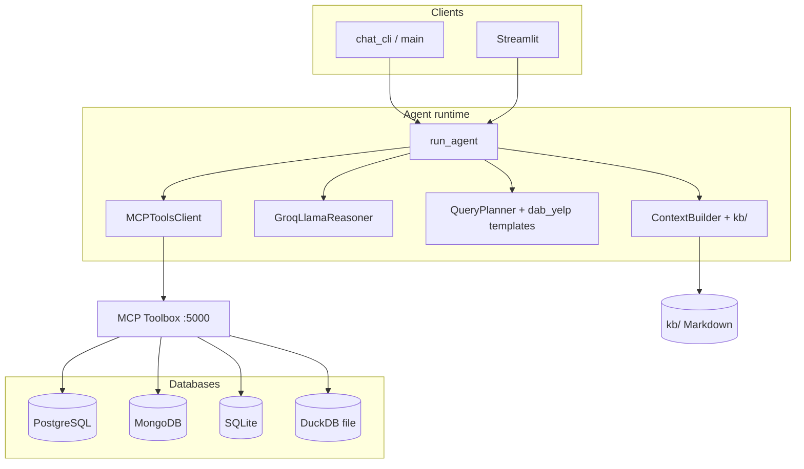

# Oracle Forge — Data Agent

A context-injection knowledge base for an LLM-powered multi-database analytics agent, built for the [DAB benchmark](https://github.com/DABenchmark).

## Team & roles (Week 8 · inception)

Sourced from `planning/inception_week8_oracle_forge.md`.

| Name     | Role                  | Primary accountability |
|----------|-----------------------|-------------------------|
| Gemechis | Driver                | Infrastructure setup, tenai-infra, MCP Toolbox, mob session lead |
| Eyor     | Driver                | Core agent build, evaluation harness, DAB benchmark submission |
| Gashaw   | Intelligence Officer  | KB v1 architecture docs, Claude Code & OpenAI source research |
| Mikias   | Intelligence Officer  | KB v2 domain docs, join key glossary, adversarial probe library |
| Meseret  | Signal Corps          | X/Twitter threads, LinkedIn article, community engagement |
| Kirubel  | Signal Corps          | Daily Slack updates, Cloudflare application, Reddit/Discord |

## Architecture

Oracle Forge is a **multi-database analytics agent**: natural language in, routed queries and merged results out. There is **no vector RAG** — the **knowledge base (`kb/`)** is plain Markdown loaded by path into the LLM prompt. Deeper design notes live in [`agent/AGENT.md`](agent/AGENT.md).

### End-to-end flow

1. **Entry points** — [`agent/chat_cli.py`](agent/chat_cli.py) (interactive CLI), [`streamlit_app.py`](streamlit_app.py) (browser), or `python -m agent.main` (single question). All call **`run_agent()`** in [`agent/main.py`](agent/main.py).
2. **Environment** — `.env` supplies API keys and URLs. Process environment wins over `.env` for keys like `MCP_BASE_URL` (needed when Streamlit runs in Docker and must use `http://toolbox:5000` instead of `localhost`).
3. **MCP Toolbox** — [`agent/tools_client.py`](agent/tools_client.py) discovers tools over HTTP (`MCP_BASE_URL`, default `http://localhost:5000/mcp`). The Toolbox container ([`mcp/docker-compose.yml`](mcp/docker-compose.yml), [`mcp/tools.yaml`](mcp/tools.yaml)) runs SQL against **PostgreSQL**, **SQLite**, Mongo pipelines, etc.; **DuckDB** may run locally via `DUCKDB_PATH` when required.
4. **Schema** — [`utils/schema_introspection_tool.py`](utils/schema_introspection_tool.py) merges MCP metadata with optional fallbacks (e.g. DataAgentBench description files).
5. **Knowledge base assembly** — [`agent/context_builder.py`](agent/context_builder.py) loads Markdown into layers:
   - **v1 — Architecture:** routing, tools, memory patterns (`kb/architecture/*.md`).
   - **v2 — Domain:** joins, glossary, unstructured patterns, and **per-engine** `kb/domain/databases/<engine>_schemas.md` for each allowed database.
   - **v3 — Corrections:** failure logs and resolved patterns (`kb/corrections/*.md`), plus optional runtime JSON.
6. **Routing** — [`agent/llm_reasoner.py`](agent/llm_reasoner.py) returns JSON guidance (`selected_databases`, hints). [`utils/query_router.py`](utils/query_router.py) and planner heuristics refine selection. Optional **multi-turn** text is passed only for routing, not for exact template matching.
7. **Planning & execution** — [`agent/planner.py`](agent/planner.py) builds one step per engine. For **DataAgentBench Yelp** benchmark strings, [`agent/dab_yelp_postgres.py`](agent/dab_yelp_postgres.py) supplies **exact-match** PostgreSQL templates; other phrasings fall back to simple heuristics (e.g. `LIMIT` queries), which is why paraphrases behave differently from the canned DAB questions.
8. **Tool loop** — [`agent/sandbox_client.py`](agent/sandbox_client.py) runs steps with retries; results are merged in Python ([`agent/main.py`](agent/main.py) — `_merge_outputs`, join keys via [`utils/join_key_resolver.py`](utils/join_key_resolver.py)). **Cross-engine joins are not done in one SQL statement** across databases.
9. **Answers** — Rows are summarized for the user; CLI/Streamlit use [`agent/user_facing_format.py`](agent/user_facing_format.py) for plain display.

### Diagram (components)



### Related layout

| Path | Role |
|------|------|
| `kb/` | Injected docs (architecture, domain, corrections); validated by injection tests |
| `agent/` | Planner, reasoner, MCP client, Streamlit/CLI entrypoints |
| `utils/` | Routing, join keys, rate limits, schema helpers — see [`utils/README.md`](utils/README.md) |
| `mcp/` | Docker Compose + Toolbox config for local/CI deploy |
| `eval/` | DAB scoring harness (`run_dab_eval.py`) |
| `DataAgentBench/` | Optional sibling clone (gitignored); large datasets and upstream DAB runtime |

---

## Facilitator setup guide

Use this to stand up a working environment for demos or grading. Commands assume a **Unix shell**; on Windows, use PowerShell equivalents or WSL.

### 1. Prerequisites

- **Git** and [Git LFS](https://git-lfs.com/) (for DataAgentBench assets if you clone it)
- **Python 3.11+** and a venv
- **Docker** with Compose (Docker Desktop on Windows, or Engine on Linux)
- **LLM API access** — set keys in `.env` (Groq and/or OpenRouter)

### 2. Clone and Python environment

```bash
git clone <your-fork-or-origin-url> oracle-forge
cd oracle-forge
python3 -m venv .venv
source .venv/bin/activate   # Windows: .venv\Scripts\activate
pip install -U pip
pip install -r requirements.txt
```

### 3. Configure `.env`

At the repo root, copy the sample if your branch includes it (`cp .env.example .env`), or create `.env` with at least: `OPENROUTER_API_KEY` or `GROQ_API_KEY`, `LLM_PROVIDER`, `MODEL_NAME`, `MCP_BASE_URL=http://localhost:5000`, database URLs/paths (`POSTGRES_DSN`, `MONGODB_URI`, `SQLITE_PATH`, `DUCKDB_PATH` as applicable). Use `ORACLE_FORGE_MOCK_MODE=false` for real databases.

### 4. Optional: DataAgentBench data

For Yelp seeds and paths referenced in Compose, clone your **DataAgentBench** fork into `./DataAgentBench` at the repo root and run `git lfs pull` inside it. See [DataAgentBench Setup and Test Run](#dataagentbench-setup-and-test-run) for detail.

### 5. Start databases and MCP Toolbox

From the repo root:

```bash
docker compose -f mcp/docker-compose.yml up -d postgres mongo toolbox
# First-time Yelp data (optional):
# docker compose -f mcp/docker-compose.yml --profile seed run --rm mongo-seed
# docker compose -f mcp/docker-compose.yml --profile seed run --rm postgres-seed
```

On Windows you can use `.\scripts\mcp_up.ps1` instead. Confirm Toolbox responds:

```bash
curl -fsS http://127.0.0.1:5000/
```

### 6. Start the web UI (optional)

```bash
docker compose -f mcp/docker-compose.yml --profile ui up -d --build streamlit
```

### 7. Verify the stack

```bash
docker compose -f mcp/docker-compose.yml ps
curl -fsS http://127.0.0.1:8501/_stcore/health
```

You should see services **Up** (and **healthy** where defined). Expect `ok` from the Streamlit health URL.

### 8. Try the agent

**CLI** (same machine as Docker; uses `localhost:5000` for MCP):

```bash
source .venv/bin/activate
python -m agent.chat_cli --dbs postgresql
```

Use an empty line, `/q`, or `exit` to quit. Answers are plain text (no query trace in the UI).

**Browser (live app link on this machine):** open **`http://localhost:8501`** or **`http://127.0.0.1:8501`**.

- From **another computer**, use **`http://<server-public-ip>:8501`** only if the security group / firewall allows **TCP 8501** and the instance has a **public** IP. Private IPs like `10.x.x.x` are not reachable from the public internet without VPN or tunneling.
- **Docker Streamlit:** Compose sets `MCP_BASE_URL=http://toolbox:5000` inside the UI container; `.env` is merged without overriding that (see `streamlit_app.py` / `run_agent`).

Optional smoke eval: set `DAB_TRIALS_PER_QUERY=1` in `.env` and run `python eval/run_dab_eval.py` (after MCP is up). KB validation: `python run_injection_tests.py`.

Further reading: [DataAgentBench Setup and Test Run](#dataagentbench-setup-and-test-run), [Team Workflow for Agent Improvement](#team-workflow-for-agent-improvement).

## CI/CD (GitHub Actions)

Workflow: [`.github/workflows/ci-cd.yml`](.github/workflows/ci-cd.yml).

- **CI (every push and pull request to `main`):** runs `pytest tests/`, then builds the Streamlit Docker image (`Dockerfile.streamlit`) to verify it still builds.
- **CD (push to `main` only):** optional SSH deploy so you do not pull repos by hand on the server.

### Enable automated deploy

1. On the deployment machine, clone this repository once to a fixed path (for example `/opt/oracle-forge`), install Docker and Docker Compose, copy `.env.example` to `.env`, and ensure the host can `git pull` (deploy key or credential for this repo).
2. In GitHub: **Settings → Secrets and variables → Actions → Variables**, add repository variable **`DEPLOY_ENABLED`** = `true`.
3. Under **Secrets**, add:

| Secret | Description |
|--------|-------------|
| `DEPLOY_HOST` | Server hostname or IP (SSH) |
| `DEPLOY_USER` | SSH user (e.g. `ubuntu`, `deploy`) |
| `DEPLOY_SSH_KEY` | Private key (PEM) that can SSH as `DEPLOY_USER` |
| `DEPLOY_PATH` | Absolute path to the clone on the server (e.g. `/opt/oracle-forge`) |

4. Push to `main`. The deploy job runs `git pull` in `DEPLOY_PATH`, then brings up Postgres, Mongo, Toolbox, and Streamlit (`--profile ui`) via `mcp/docker-compose.yml`.

To **turn off** deploys but keep CI, set **`DEPLOY_ENABLED`** to `false` or delete the variable.

**Security:** restrict SSH keys to the deploy user, firewall the server, and use HTTPS in front of Streamlit in production. The workflow does not print your secrets.

Local test run (same as CI):

```bash
pip install -r requirements.txt
pip install pytest
pytest tests/ -q
```

## How it works (knowledge base)

Each Markdown file under `kb/` is written to be pasted into the LLM context **by path** (no embeddings). [`agent/context_builder.py`](agent/context_builder.py) selects layers at runtime; see **Architecture** above. Documents are regression-checked with **injection tests** (`kb/injection_test.py`, `run_injection_tests.py`): the model must answer with enough keyword overlap to pass.

## Repository structure

```text
oracle-forge/
├── agent/                 # run_agent, planner, MCP client, AGENT.md
├── kb/                    # Knowledge base (architecture, domain, corrections, evaluation)
│   ├── architecture/
│   ├── domain/
│   ├── corrections/
│   ├── evaluation/
│   └── injection_test.py
├── eval/                  # DAB eval harness (run_dab_eval.py)
├── mcp/                   # docker-compose.yml, Toolbox tooling
├── utils/                 # Shared helpers (see utils/README.md)
├── tests/                 # Pytest regression tests
├── streamlit_app.py       # Browser UI
├── Dockerfile.streamlit
├── .github/workflows/     # CI/CD (ci-cd.yml)
├── requirements.txt
└── setup_groq_tests.sh
```

`DataAgentBench/` is optional and gitignored when present (large fork clone).

## Setup

```bash
# Install dependencies
pip install -r requirements.txt

# Configure Groq API key (interactive — writes key to .env)
bash setup_groq_tests.sh

# Or add to .env manually (run_injection_tests.py reads this automatically)
echo 'GROQ_API_KEY="your-key-here"' >> .env

# Or export for the current shell session only
export GROQ_API_KEY="your-key-here"
```

## Running Injection Tests

Use `run_injection_tests.py` from the **project root** — it reads `.env` automatically and saves timestamped results to `injection_results/`.

```bash
# Full suite — saves JSON + Markdown to injection_results/
python run_injection_tests.py

# Full suite with LLM answers printed
python run_injection_tests.py --verbose

# Full suite + update kb/INJECTION_TEST_LOG.md
python run_injection_tests.py --update-log

# Check that all document paths resolve (no API call)
python run_injection_tests.py --validate-paths

# Test a single document
python run_injection_tests.py --test-single architecture/memory.md

# Custom results directory
python run_injection_tests.py --results-dir ./my_results
```

**Direct runner** (if you need lower-level control or are calling from a script):

```bash
# Must be run from the project root; pass --kb-path and --api-key explicitly
python kb/injection_test.py --kb-path ./kb --api-key "$GROQ_API_KEY"
python kb/injection_test.py --kb-path ./kb --api-key "$GROQ_API_KEY" --verbose
python kb/injection_test.py --kb-path ./kb --api-key "$GROQ_API_KEY" --test-single architecture/memory.md
python kb/injection_test.py --kb-path ./kb --api-key "$GROQ_API_KEY" --validate-paths
```

Results are written to `injection_results/` as `injection_test_YYYY-MM-DD_HH-MM-SS.json` and `.md`.

Current pass rate: **21/21 (100%)** — see `injection_results/`.

## DataAgentBench Setup and Test Run

Use this section when you want to run DAB end-to-end from this project while we improve agent performance.

### 1) Prepare DataAgentBench (Fork-First)

Use your team fork as the primary source of truth for runtime/agent changes.

```bash
# from oracle-forge root
git lfs install
git clone https://github.com/gemechisworku/DataAgentBench.git
cd DataAgentBench
git remote add upstream https://github.com/ucbepic/DataAgentBench.git
git lfs pull
```

Recommended branch model:
- `main` in your fork tracks upstream-compatible baseline
- feature branches for experiments/fixes (e.g., `feature/openrouter-dab`)
- merge tested changes into your fork `main`

### 2) Create Python environment

`conda` is optional. We use `uv` + `venv` reliably on Windows.

```bash
# from DataAgentBench/
uv venv --python 3.11 .venv
# PowerShell
.\\.venv\\Scripts\\Activate.ps1

uv pip install openai python-dotenv pyyaml pandas numpy duckdb pymongo sqlalchemy psycopg2-binary autogen-core "autogen-ext[docker]==0.7.5" docker colorlog asyncio-atexit
```

### 3) Configure model/provider credentials

Create `DataAgentBench/.env`:

```env
OPENROUTER_API_KEY=your_openrouter_key
OPENROUTER_SITE_URL=https://your-site.example
OPENROUTER_APP_NAME=OracleForge-DAB
```

### 4) Choose execution backend

Docker backend is benchmark-faithful. Local backend is useful for development when Docker is unavailable.

```bash
# benchmark-faithful
docker build -t python-data:3.12 .

# dev fallback (PowerShell)
$env:DAB_EXECUTOR="local"
```

### 4b) Start MCP Toolbox for Oracle Forge eval (Docker, required)

`eval/run_dab_eval.py` uses Oracle Forge's MCP tool client (not DAB's built-in DataAgent runtime), so MCP Toolbox must be up before evaluation.

1. Create root `.env` from `.env.example` and set DB/toolbox values:
   - `MCP_BASE_URL`
   - `POSTGRES_DSN`
   - `MONGODB_URI`
   - `MONGODB_DATABASE`
   - `SQLITE_PATH`
   - `DUCKDB_PATH`
   - keep `ORACLE_FORGE_MOCK_MODE=false`
   - keep `ORACLE_FORGE_ALLOW_MOCK_FALLBACK=false`
2. Start Docker Desktop, then bring up databases and seed Yelp Mongo data:

```powershell
docker compose -f mcp/docker-compose.yml up -d postgres mongo
docker compose -f mcp/docker-compose.yml --profile seed run --rm mongo-seed
```

3. Start/recreate Toolbox:

```powershell
docker compose -f mcp/docker-compose.yml up -d --force-recreate toolbox
```

4. Verify MCP is reachable:

```powershell
.\scripts\mcp_status.ps1
```

Note:
- Current Toolbox config exposes `postgres_sql_query`, `sqlite_sql_query`, and Mongo aggregate tools.
- For DAB datasets that declare a DuckDB file (for example Yelp `user_database`), the agent uses a local DuckDB SQL fallback via `DUCKDB_PATH`.
- Ensure the Python environment running eval has the `duckdb` package installed.

Or manual MCP check:

```powershell
$body = '{"jsonrpc":"2.0","id":"tools-list","method":"tools/list","params":{}}'
curl.exe -X POST http://localhost:5000/mcp -H "Content-Type: application/json" -d $body
```

5. Optional one-command startup wrapper:

```powershell
.\scripts\mcp_up.ps1
```

6. Shut down when done:

```powershell
.\scripts\mcp_down.ps1
```

If MCP is unreachable, eval now fails fast with an explicit error instead of silently using mock data.

### 5) Run a first DAB built-in agent query test

```bash
# from DataAgentBench/
python run_agent.py --dataset stockindex --query_id 1 --llm openrouter/openai/gpt-4o-mini --iterations 60 --root_name smoke_or_0
```

Logs are saved under:
`DataAgentBench/query_<dataset>/query<id>/logs/data_agent/<root_name>/`

### 6) Validate the run

```bash
python -c "from pathlib import Path; import json; from common_scaffold.validate.validate import validate; q=Path('query_stockindex/query1'); r=q/'logs'/'data_agent'/'smoke_or_0'/'final_agent.json'; d=json.loads(r.read_text(encoding='utf-8')); print(validate(q, d['final_result'], d['terminate_reason']))"
```

Expected for `stockindex/query1`: `is_valid: True` and target symbol `399001.SZ`.

### 7) Run Oracle Forge eval against DAB (after MCP is up)

Set these once in root `.env` (no inline PowerShell env args required):
- `MCP_BASE_URL=http://localhost:5000`
- `ORACLE_FORGE_MOCK_MODE=false`
- `ORACLE_FORGE_ALLOW_MOCK_FALLBACK=false`
- `LLM_PROVIDER=openrouter`
- `OPENROUTER_API_KEY=<your_key>`
- `MODEL_NAME=openai/gpt-4o-mini`
- `DAB_DATASET=yelp`
- `DAB_TRIALS_PER_QUERY=1` (smoke) or `50` (full)

Then run:

```powershell
python eval\run_dab_eval.py
```

Outputs are written to:
- `eval/results.json`
- `eval/score_log.jsonl`

## Team Workflow for Agent Improvement

Use this loop to improve pass rates without losing traceability:

1. Update knowledge artifacts in this repo (`kb/`, `probes/`, `utils/`) based on failures.
2. Port practical fixes into `DataAgentBench/common_scaffold/` (prompting, tool usage, routing/execution behavior).
3. Run targeted DAB query tests first (single query, fixed `root_name` per run).
4. Validate with `common_scaffold.validate.validate`.
5. Record failure pattern and fix in `kb/corrections/` to prevent regressions.
6. Scale from single-query tests to dataset-level runs once targeted failures are resolved.

Notes:
- `run_agent.py` in our working DAB copy defaults to `--use_hints` enabled.
- OpenRouter is supported via `--llm openrouter/<provider>/<model>`.
- If provider connectivity is unstable, rerun with a new `--root_name` and check `final_agent.json` + `llm_calls.jsonl` before changing code.
- `DataAgentBench/` is intentionally ignored in this repo to avoid committing a full vendor clone.
- Fork-first means canonical runtime code lives in your DAB fork; this repo tracks KB, probes, and workflow docs.

## If You Modify DAB Files

When contributors change files inside `DataAgentBench/`, use fork branches + PRs as the default workflow.

Required steps:
1. Create a feature branch in your DAB fork.
2. Make and validate DAB changes locally.
3. Commit and push to your fork, then open a PR to your fork `main` (or release branch).
4. Record the fork URL + branch/commit in this repo docs when needed for reproducibility.
5. Commit only repo files here (`README.md`, KB/probes/docs/scripts), not `DataAgentBench/`.

Optional (for users not using your fork): refresh patch artifacts in this repo:
```powershell
.\scripts\refresh_dab_patch.ps1 -DabPath .\DataAgentBench
```
Then verify:
```powershell
.\scripts\verify_dab_patch.ps1 -DabPath .\DataAgentBench
```

If users already have local edits in `DataAgentBench/`, they should commit/stash/revert them before applying `dab-setup.patch`.

## Session start — document load order

[`ContextBuilder`](agent/context_builder.py) assembles layers from `kb/`:

- **Architecture (v1):** `memory.md`, `conductor_worker_pattern.md`, `openai_layers.md`, `tool_scoping_philosophy.md` under `kb/architecture/`.
- **Domain (v2):** joins, glossary, unstructured patterns, fiscal calendar, etc., plus **`kb/domain/databases/<engine>_schemas.md`** for each database in the allowlist.
- **Corrections (v3):** `failure_log.md`, `failure_by_category.md`, `resolved_patterns.md`, `regression_prevention.md` under `kb/corrections/`, plus optional runtime JSON.

Runtime schema from MCP is merged into the context as JSON (see `SchemaIntrospectionTool`).

## Adding a KB Document

1. Create the file in the appropriate `kb/` subdirectory
2. Add a test case to `EXPECTED_ANSWERS` in `kb/injection_test.py`
3. Run `python kb/injection_test.py --test-single <path> --verbose`
4. Revise until the test passes, then add a `CHANGELOG.md` entry

## Attribution

- Three-layer memory + autoDream — Claude Code architecture (March 2026)
- Six-layer context — OpenAI data agent writeup (Jan 2026)
- Injection test methodology — Andrej Karpathy
- Domain requirements — UC Berkeley DAB benchmark
